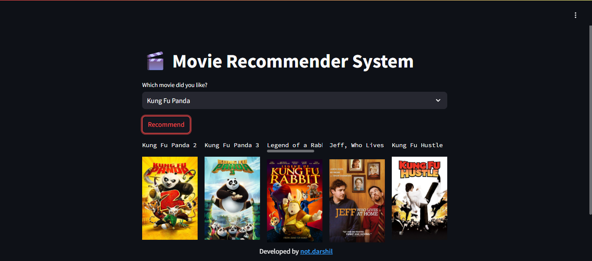
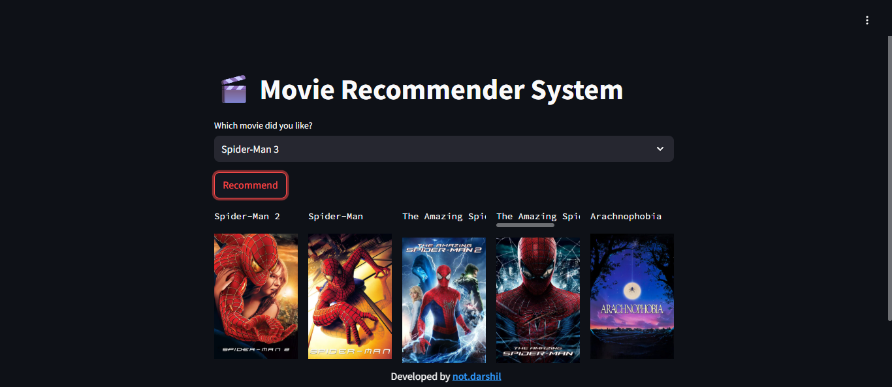

# 🎬 Movie Recommender System

  

A simple **Streamlit web app** that recommends movies based on your selection.

It uses a precomputed similarity matrix and The Movie Database (TMDb) API to fetch movie posters.

  

## 🚀 Features

  

- Select a movie from the dropdown.

- Get **5 similar movie recommendations** instantly.

- Fetches high-quality posters via TMDb API.

- Responsive and minimal UI powered by Streamlit.

- Works directly in the browser — no installation needed for the user.

  

## 🛠 Tech Stack

  

-  **Python 3.9+**

-  **Streamlit** (Web UI)

-  **Pandas** (Data handling)

-  **Requests** (API calls)

-  **Pickle** (Serialized data)

  

## 📂 Project Structure

  

```

├── app.py # Main Streamlit app

├── movie_dict.pkl# Movie metadata dictionary

├── crisp_similarity.pkl # Precomputed similarity matrix

├── requirements.txt # Dependencies

├── README.md # Project documentation

└── datasets/ # (Optional) Raw datasets

```

## 📦 Installation & Local Setup

  

1.  **Clone the repository**

  

` git clone https://github.com/Not-Darshil/movie-recommender.git `

`cd movie-recommender`

  

2.  **Create virtual environment (optional but recommended)**

  

`python -m venv venv `

`source venv/bin/activate # Mac/Linux `

`venv\Scripts\activate # Windows`

  

3.  **Install dependencies**

  

`pip install -r requirements.txt`

  

4.  **Run the app**

  

`streamlit run app.py`

  

----------

  
  

## 🌐 Live Demo

  

**Deployed on Render:** [Movie Recommender](https://movie-recommender-67cm.onrender.com/)

*Note: The site may take a few seconds to load if it has been inactive.*

  

----------

  

## ⚙ Configuration

  

**TMDb API Key**

1. Create a `.env` file in the root directory of the project.

2. Add your API key inside it:

`TMDB_API_KEY=your_api_key_here`

----------

  

## 📷 Screenshots

  






  

----------

  

## 📜 License

  

This project is licensed under the MIT License — feel free to modify and use.